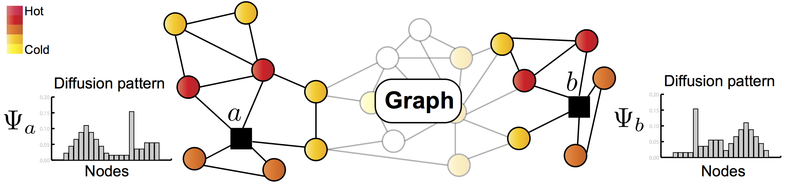

GraphWave 
===============
[](https://arxiv.org/abs/1710.10321) [](https://codebeat.co/projects/github-com-benedekrozemberczki-graphwavemachine-master) [](https://github.com/benedekrozemberczki/GraphWaveMachine/archive/master.zip)⠀[](https://twitter.com/intent/follow?screen_name=benrozemberczki)

<p align="center">
  
</p>


### Abstract
<p align="justify">
Nodes residing in different parts of a graph can have similar structural roles within their local network topology. The identification of such roles provides key insight into the organization of networks and can be used for a variety of machine learning tasks. However, learning structural representations of nodes is a challenging problem, and it has typically involved manually specifying and tailoring topological features for each node. In this paper, we develop GraphWave, a method that represents each node's network neighborhood via a low-dimensional embedding by leveraging heat wavelet diffusion patterns. Instead of training on hand-selected features, GraphWave learns these embeddings in an unsupervised way. We mathematically prove that nodes with similar network neighborhoods will have similar GraphWave embeddings even though these nodes may reside in very different parts of the network, and our method scales linearly with the number of edges. Experiments in a variety of different settings demonstrate GraphWave's real-world potential for capturing structural roles in networks, and our approach outperforms existing state-of-the-art baselines in every experiment, by as much as 137%. 
</p>

The model is now also available in the package [Karate Club](https://github.com/benedekrozemberczki/karateclub).

This repository provides an implementation for GraphWave as it is described in:
> Learning Structural Node Embeddings Via Diffusion Wavelets.
> Claire Donnat, Marinka Zitnik, David Hallac and Jure Leskovec.
> Proceedings of the  24th SIGKDD Conference on Knowledge Discovery and Data Mining (KDD-18).

The **dense** reference implementation is available [[here]](https://github.com/snap-stanford/graphwave).

### Requirements

The codebase is implemented in Python 3.5.2 | Anaconda 4.2.0 (64-bit). Package versions used for development are just below.
```
networkx          1.11
tqdm              4.19.5
numpy             1.15.4
pandas            0.23.4
pygsp             0.5.1
texttable         1.5.0
```

### Datasets
<p align="justify">
The code takes an input graph in a csv file. Every row indicates an edge between two nodes separated by a comma. The first row is a header. Nodes should be indexed starting with 0. A sample graph for the `Facebook Restaurants` dataset is included in the  `data/` directory.</p>

### Options
Learning of the embedding is handled by the `src/main.py` script which provides the following command line arguments.

#### Input and output options
```
  --input     STR    Input dataset.    Default is `data/food_edges.csv`.
  --output    STR    Output dataset.   Default is `output/embedding.csv`.
```
#### Model options
```
  --mechanism           STR          Wavelet generation method.                          Default is `exact`.
  --heat-coefficient    FLOAT        Heat kernel coefficient.                            Default is 1000.0.
  --sample-number       INT          Number of characteristic function samples.          Default is 50.
  --approximation       INT          Order of Chebyshev polynomial.                      Default is 100.
  --step-size           INT          Sampling step size.                                 Default is 20.
  --switch              INT          Graph size at procedure switches to approximation.  Default is 100.
```

### Examples
<p align="justify">
The following commands learn a graph embedding and writes it to disk. The node representations are ordered by the ID. Creating a GraphWave embedding of the default dataset with the default hyperparameter settings. Saving the embedding at the default path.</p>

```sh
$ python src/main.py
```

Creating an embedding of an other dataset the `Facebook Companies`. Saving the output and the log in a custom place.

```sh
$ python src/main.py --input data/company_edges.csv  --output output/company_embedding.csv
```

Creating an embedding of the default dataset in 128 dimensions.

```sh
$ python src/main.py --sample-number 128
```

--------------------------------------------------------------------------------

**License**

- [GNU License](https://github.com/benedekrozemberczki/GraphWaveMachine/blob/master/LICENSE)

--------------------------------------------------------------------------------
