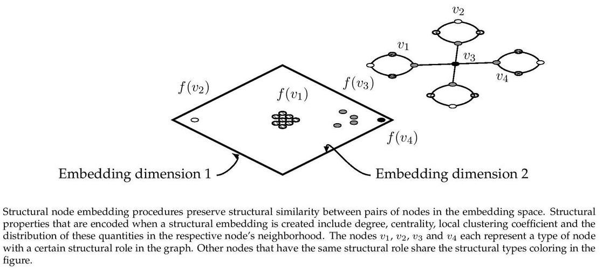

# WaveletMachine

<p align="justify">
GraphWave is a structural node embedding algorithm which learns an embedding based on the characteristic function of graph diffusion wavelets. The procedure places nodes in an abstract feature space where nodes with similar features have similar structural roles.
</p>

<p align="center">
  
</p>

This repository provides an implementation for GraphWave as it is described in:
> Learning Structural Node Embeddings Via Diffusion Wavelets.
> Claire Donnat, Marinka Zitnik, David Hallac and Jure Leskovec.
> Proceedings of the  24th SIGKDD Conference on Knowledge Discovery and Data Mining (KDD-18).


### Requirements

The codebase is implemented in Python 2.7.
package versions used for development are just below.
```
networkx          1.11
tqdm              4.19.5
numpy             1.13.3
pandas            0.20.3
pygsp             0.5.1
```

### Datasets

The code takes an input graph in a csv file. Every row indicates an edge between two nodes separated by a comma. The first row is a header. Nodes should be indexed starting with 0. A sample graph for the `Facebook Restaurants` dataset is included in the  `data/` directory.

### Options

Learning of the embedding is handled by the `src/main.py` script which provides the following command line arguments.

```
  --mechanism STR               Wavelet generation method.                                    Default is `exact`.
  --input STR                   Input dataset.                                                Default is `data/food_edges.csv`.
  --output STR                  Output dataset.                                               Default is `output/embedding.csv`.
  --heat-coefficient FLOAT      Heat kernel coefficient.                                      Default is 1000.0.
  --sample-number INT           Number of characteristic function samples.                    Default is 50.
  --approximation INT           Order of Chebyshev polynomial.                                Default is 100.
  --step-size INT               Sampling step size.                                           Default is 20.
  --switch INT                  Graph size when approximation is the automatic choice.        Default is 100.
```

### Examples

The following commands learn a graph embedding and writes it to disk. The node representations are ordered by the ID.

Creating a GraphWave embedding of the default dataset with the default hyperparameter settings. Saving the embedding at the default path.

```
python src/main.py
```

Creating an embedding of an other dataset the `Facebook Companies`. Saving the output and the log in a custom place.

```
python src/main.py --input data/company_edges.csv  --output output/company_embedding.csv
```

Creating an embedding of the default dataset in 128 dimensions.

```
python src/main.py --sample-number 128
```
